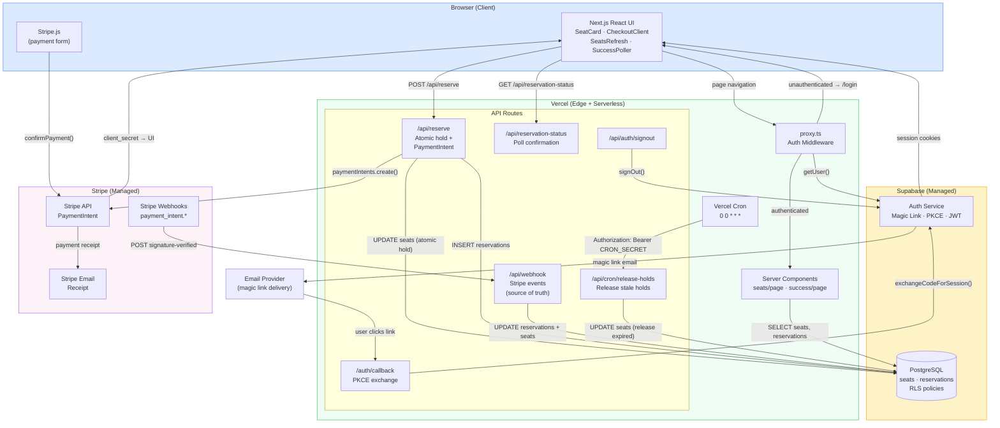
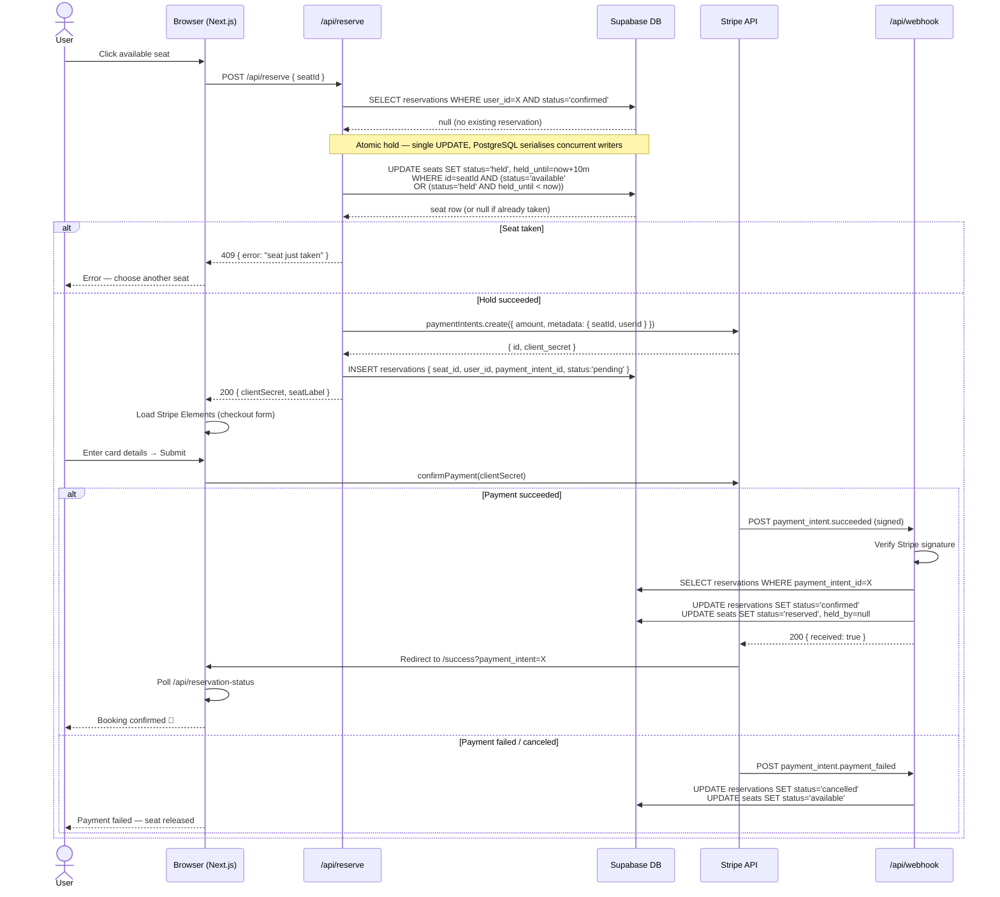
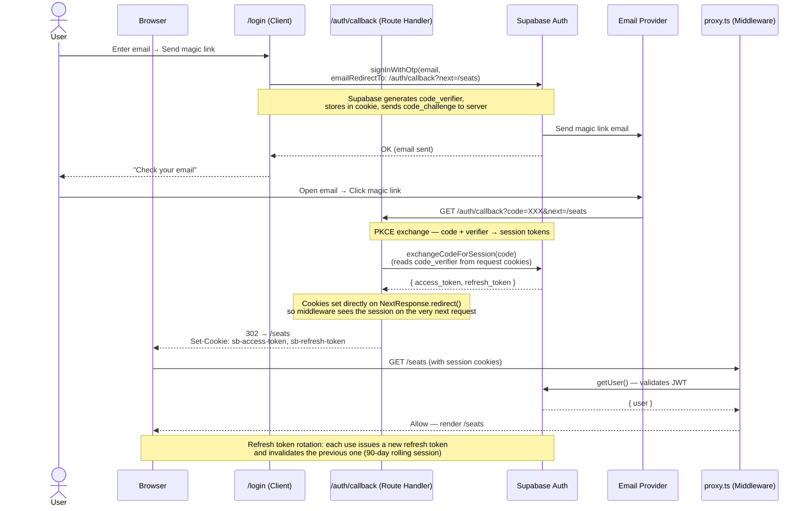
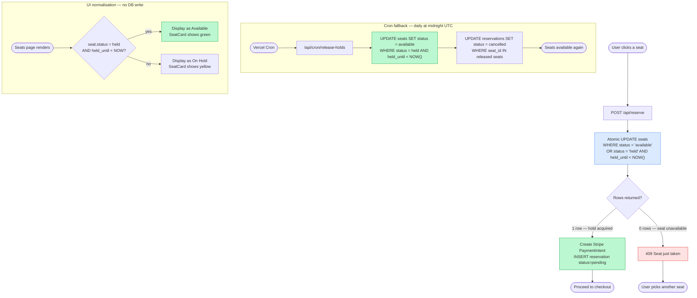
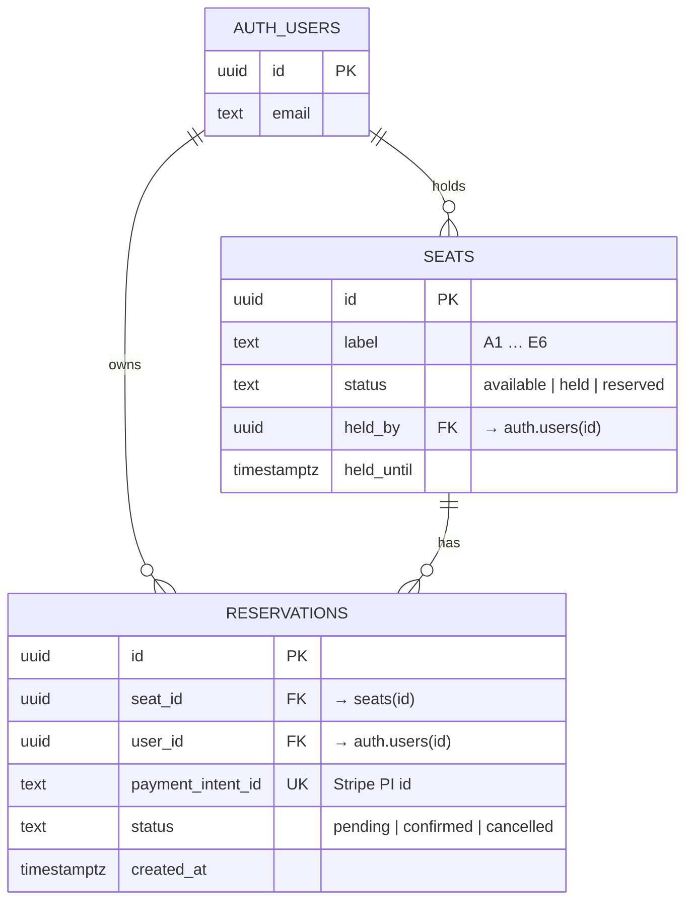
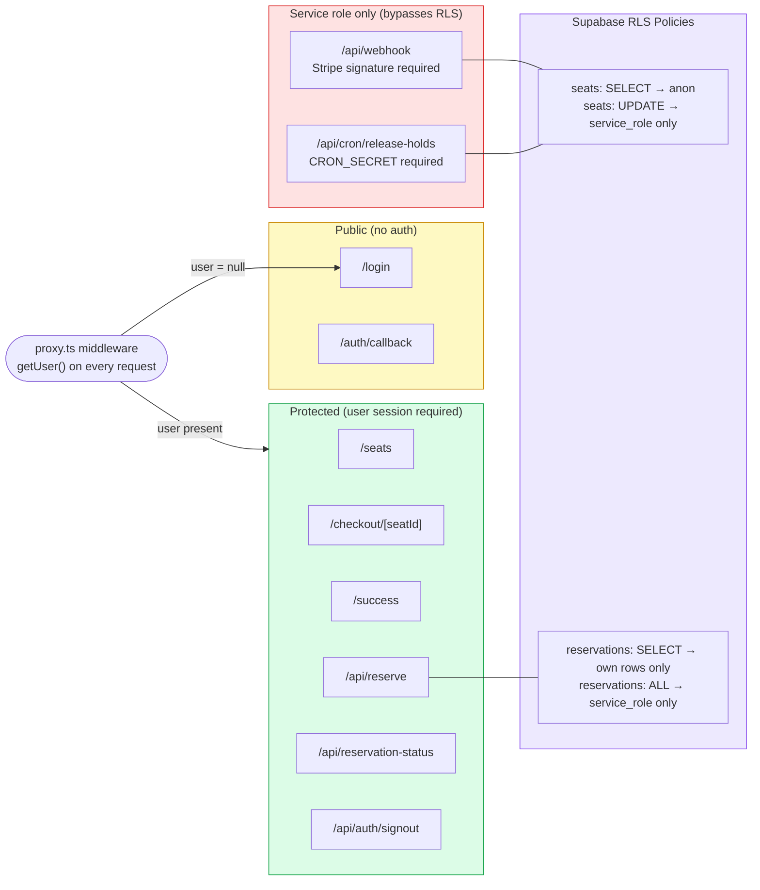

# Architecture Diagrams

---

## 1. System Overview

High-level view of all services and how they connect.

---

## 2. Seat Reservation Flow

End-to-end flow from seat selection to confirmed reservation.

---

## 3. Magic Link Authentication Flow

PKCE-based magic link flow from login to session.

---

## 4. Expired Hold Reclaim Strategy

How expired holds are recovered — two complementary mechanisms.

---

## 5. Database Schema

**Concurrency safety:**
- `UPDATE seats … WHERE status='available' OR (status='held' AND held_until < now)` — atomic; PostgreSQL row-level lock ensures exactly one writer wins
- `CREATE UNIQUE INDEX one_confirmed_per_seat ON reservations (seat_id) WHERE (status = 'confirmed')` — DB-level backstop preventing double-confirmed reservations even if application logic has a bug

---

## 6. Security Boundaries

